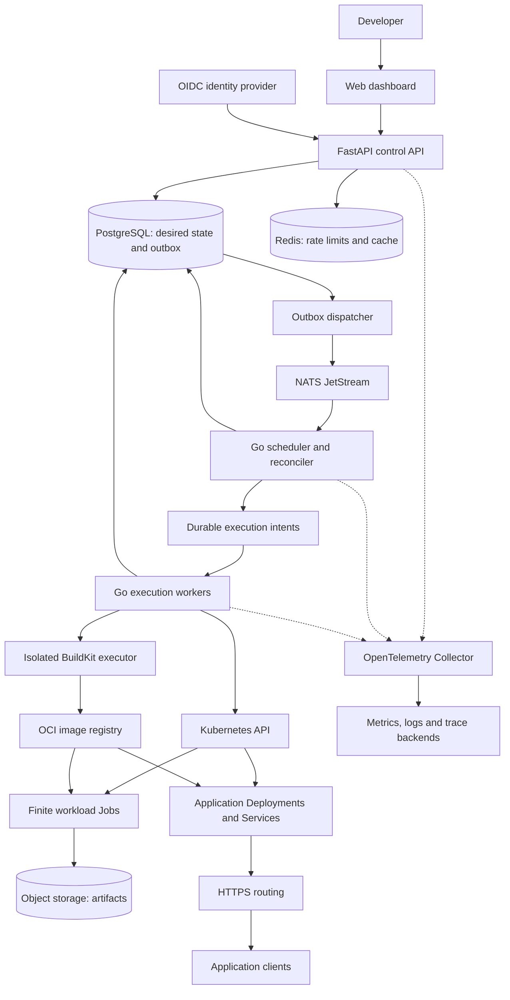

# HamiCloud — Distributed Application Runtime

## Engineering roadmap (standalone)

**Prepared for:** hami9
**Planning date:** September 12, 2026
**Document status:** Proposed architecture and implementation plan
**Language:** English
**Working name:** HamiCloud; naming availability has not been checked.
**Companion project:** HamiKnowledge (separate roadmap, separate repository). HamiCloud does not depend on it.

> Build HamiCloud first. Make deploying an HTTP service, running a background job, and recovering from failure work through the product UI.

All milestones below are planned work. Performance numbers are initial acceptance targets, not measured results. This document does not claim that the platform already exists or has passed production validation.

## Contents

1. [Recommendation and portfolio fit](#recommendation-and-portfolio-fit)
2. [Product definition](#product-definition)
3. [Runtime architecture and responsibilities](#runtime-architecture-and-responsibilities)
4. [Runtime contracts and failure handling](#runtime-contracts-and-failure-handling)
5. [MVP and phased roadmap](#mvp-and-phased-roadmap)
6. [Runtime testing and benchmarks](#runtime-testing-and-benchmarks)
7. [Observability and operations](#observability-and-operations)
8. [Security and tenant isolation](#security-and-tenant-isolation)
9. [CI/CD and deployment](#cicd-and-deployment)
10. [Repository and README checklists](#repository-and-readme-checklists)
11. [Portfolio and demo checklists](#portfolio-and-demo-checklists)
12. [Definition of done and execution plan](#definition-of-done-and-execution-plan)

## Recommendation and portfolio fit

### Why this is the strongest next project

The current [GitHub profile](https://github.com/hami9) lists Linux, Docker, FastAPI, PostgreSQL, Redis, and GitHub Actions, with Go and Kubernetes under current learning. Its visible pinned projects include Mira, Astolfo, proc123, and telegram-linux-bot. This supports choosing a project that connects application development with operating infrastructure. This is a review of the public profile, not a code audit of those repositories.

The referenced conversation also mentioned RunCode and Throttlr. Treat those as possible integrations to inspect later; their current APIs, licenses, maintenance status, and suitability have not been independently validated for this plan. The portfolio website, [hami9.ir](https://hami9.ir), could not be retrieved by the research tool. No conclusions about its current content or availability are drawn from that limitation.

**Recommendation:** HamiCloud should become the flagship infrastructure project. The portfolio argument is an engineering judgment: this project would add evidence of orchestration, failure recovery, deployment, and operations to the existing profile.

| Evidence to add | What a reviewer should be able to inspect |
| --- | --- |
| Go and distributed systems | Scheduler policy, reconciliation, concurrency tests, duplicate delivery handling |
| Kubernetes and operations | Helm installation, workloads, health probes, quotas, rollback and recovery records |
| Backend engineering | FastAPI contracts, authorization, transactions, migrations, idempotency |
| Product completion | A usable dashboard, reproducible quickstart and recorded failure scenarios |

### How the existing work can connect

- Use a small FastAPI application as the first deployable service. A compatible existing application can become a later example after inspection.
- Turn a controlled CSV transformation into a background job to connect with the proc123 domain without depending on live scraping.
- If Throttlr is reusable, place it behind a rate-limiter interface and compare it with the initial Redis implementation. Do not make its adoption an MVP dependency.
- Treat RunCode as relevant runtime experience. Importing its execution engine is optional and requires a separate compatibility and security review.

### Relationship to HamiKnowledge

HamiKnowledge is a separate, smaller companion project with its own roadmap and repository. It is deployed *as a tenant application* on HamiCloud and therefore acts as a practical test of HamiCloud's public interfaces. Nothing in this roadmap is blocked by it. Do not start the companion implementation before M6 unless HamiCloud work is deliberately paused.

## Product definition

### Product goal

Build a self-hosted platform where an invited developer can deploy an HTTP application from a container image, run background jobs, and inspect their behavior. Extend it to build a connected Git repository and deploy the resulting immutable image.

**Product promise:** "Deploy a service, run a job, see what happened, and recover when something fails."

**Primary user:** A developer operating a few internal applications or a small team's services on a single Kubernetes cluster.

### Supported workload types

| Workload | User input | Runtime resource | Visible result |
| --- | --- | --- | --- |
| HTTP service | Image digest, port, environment, health path, resource limits | Kubernetes Deployment, Service and route | HTTPS URL, rollout status, logs and rollback history |
| One-off job | Image digest, argument array, timeout and retry policy | Kubernetes Job per platform attempt | Attempt timeline, exit status, logs and downloadable artifact |
| Source deployment | Connected repository, commit SHA and Dockerfile | Isolated build task, registry artifact, then service release | Build logs, image digest, commit-to-release history |

Long-running queue workers, scheduled jobs, private repositories, and multiple clusters are extensions after v1. An initial job must be finite; it should not secretly become a permanently running worker.

### Scope boundaries

**MVP:** One cluster, invited users, reviewed image allowlist, HTTP services, finite jobs, dashboard, retries, logs, and manual rollback.

**v1:** Add connected approved repositories, reproducible build-to-deploy flow, multiple workspaces, tenant isolation tests, quotas, observability, release automation, and documented recovery.

**Outside v1:** Anonymous arbitrary code execution, a general-purpose cloud marketplace, billing, multi-region scheduling, a custom container runtime, a replacement Kubernetes scheduler, arbitrary Kubernetes YAML, managed databases for each user, a service mesh, and an autonomous deployment agent.

Stateful applications with durable application volumes are outside the first release. Platform PostgreSQL and object storage are persistent infrastructure; they do not imply that arbitrary stateful tenant applications are supported.

## Runtime architecture and responsibilities

### System diagram



The diagram combines the final v1 components. The MVP starts without source builds and with fewer replicas. Application traffic travels through the routing layer directly to the application Service; it does not pass through the control API.

### Technology decisions

| Layer | Default choice | Responsibility and reason |
| --- | --- | --- |
| Control API | Python, FastAPI, Pydantic, SQLAlchemy, Alembic | User-facing resources, validation, authorization, state transactions and schema migrations |
| Orchestration | Go, `client-go`, `pgx` | Concurrent reconciliation, admission decisions, execution workers and Kubernetes integration |
| Durable state | PostgreSQL | Desired state, attempts, releases, quotas, idempotency records, audit events and outbox |
| Messaging | NATS JetStream | Durable work notifications with explicit acknowledgment and bounded consumers |
| Rate limits/cache | Redis | Atomic API token buckets and disposable caches; not a second durable job queue |
| Packaging/builds | Dockerfiles, OCI images, BuildKit | Reproducible artifacts and isolated builds from approved repositories |
| Execution | Kubernetes, containerd, Helm | Workload lifecycle and installable platform packaging |
| Routing | Traefik, DNS, TLS certificates | Application URLs and HTTPS entry point; pin a supported configuration |
| Artifacts | S3-compatible object storage | Job outputs, build artifacts where needed, and backup exports |
| Identity | An OIDC provider; Keycloak for the local reference setup | Standard sign-in and short-lived identity tokens |
| Dashboard | React, TypeScript, Vite, Tailwind CSS | Workspaces, deployments, jobs, logs, errors and recovery controls |
| Telemetry | OpenTelemetry, Prometheus, Grafana, Loki, Tempo | Instrumentation, metrics, logs and distributed traces |
| Automation | GitHub Actions, GHCR | CI, image publication and controlled promotion by digest |
| Tests | Go tests/race detector, pytest, Playwright, k6 | Concurrency, API, full user journeys and load measurements |

Pin supported versions and container digests at implementation time. Keep the tested compatibility matrix in the repository. This plan intentionally does not guess future patch versions.

### Keep ownership clear

- **FastAPI owns product access:** authentication, authorization, request validation, desired-state changes, and the public API contract.
- **The Go scheduler owns admission:** when a build/job/release may start, workspace quotas, fairness, retry timing, and durable execution intents.
- **Go execution workers own reconciliation:** create or update approved Kubernetes resources, observe outcomes, and persist actual state. A worker is a control process; a tenant job container is a separate workload.
- **Kubernetes owns Pod placement and lifecycle.** HamiCloud chooses eligible work; Kubernetes chooses nodes. This division follows [Kubernetes scheduling responsibilities](https://kubernetes.io/docs/concepts/scheduling-eviction/kube-scheduler/).
- **PostgreSQL owns truth.** Queue messages wake up processing; a missing notification must not erase accepted work. A periodic reconciliation scan repairs missed notifications.
- **NATS owns delivery, Redis owns rate-limit state.** Do not also add Celery, Kafka, or Redis Streams to this version.

Use one Go codebase with scheduler and executor process modes. Keep FastAPI as a modular service instead of splitting every entity into a microservice. Begin with versioned JSON event contracts; introduce gRPC only if a measured synchronous internal interaction needs it.

### Data model

| Entity | Essential fields or constraints |
| --- | --- |
| Workspace / membership | Workspace ID, user subject, role; unique membership |
| Project / application | Workspace ID, desired generation, workload type and current release |
| Release / build | Commit SHA, image digest, configuration version, build status and provenance |
| Job / attempt | Logical job ID, attempt number, state, deadline, exit code, resource UID and lease epoch |
| Execution intent | Resource identity, desired generation, owning attempt/release and reconciliation state |
| Outbox / consumed event | Event ID, schema version, publish status; unique consumed event per handler |
| Quota reservation | Workspace, resource class, reservation ID, expiry and release status |
| Idempotency record | Workspace, endpoint, key, request hash and stored response |
| Secret reference | Encrypted value or external reference, key version; never plaintext in event bodies |
| Audit event | Actor, workspace, action, target, result and timestamp |

Use foreign keys and unique constraints for correctness. Python migrations own the shared schema. Go reads and writes through documented queries and transition rules; both implementations run compatibility tests against those migrations.

### Public API contract

| Operation | Proposed endpoint | Required behavior |
| --- | --- | --- |
| Create application | `POST /v1/workspaces/{ws}/apps` | Validate ownership, image policy, limits and health configuration |
| Deploy a release | `POST /v1/apps/{app}/deployments` | Return `202` and operation ID after durable acceptance |
| Submit a job | `POST /v1/workspaces/{ws}/jobs` | Require idempotency key; return job ID and status URL |
| Inspect or cancel job | `GET /v1/jobs/{job}`; `POST /v1/jobs/{job}/cancel` | Show attempts; cancellation is a tracked operation |
| Inspect operation status¹ | `GET /v1/operations/{op}` | Return the current status, kind and status URL of an accepted asynchronous operation |
| Read logs/events | `GET /v1/operations/{op}/events` | Authorized SSE stream with reconnect cursor and bounded retention |
| Roll back | `POST /v1/apps/{app}/rollbacks` | Create a new release referencing an older image/configuration |
| Re-run failed work | `POST /v1/jobs/{job}/reruns` | Create a new audited logical job linked to its predecessor |
| List workspace jobs² | `GET /v1/workspaces/{ws}/jobs` | Cursor-paginated listing of jobs in a workspace; check workspace membership |
| List app releases² | `GET /v1/apps/{app}/releases` | Cursor-paginated listing of releases for an application; check application workspace membership |

¹ Added on 2026-09-14 with owner approval. The endpoint was already in the code and in `contracts/openapi/v1.yaml` as of commit `dc0db7c`; this row brings the Roadmap in line with them.
² Added on 2026-09-19 with owner approval (Decision D3). Provides cursor-paginated collection endpoints to support API pagination requirements in M0.

All ID-based lookups must check workspace ownership. Pagination, structured error codes, a correlation ID, and OpenAPI documentation are required. Reusing an idempotency key with a different request body returns a conflict; identical retries return the original accepted operation. Store keys for at least 24 hours and publish that retention contract.

## Runtime contracts and failure handling

### State and deployment behavior

```text
Job:
QUEUED -> ADMITTED -> STARTING -> RUNNING -> SUCCEEDED
                         |          |
                         +----------+-> RETRY_WAIT -> QUEUED
                         +----------+-> FAILED -> dead-letter entry
Any active state -> CANCEL_REQUESTED -> CANCELLED

Source release:
REQUESTED -> BUILDING -> IMAGE_READY -> DEPLOYING -> HEALTHY
                |                         |
                +-> BUILD_FAILED          +-> DEPLOY_FAILED

Rollback:
new release -> previous image digest + compatible configuration -> health verification
```

Record logical job state separately from attempt state. A retry creates a new attempt; a message redelivery does not. Image-based deployments start at `IMAGE_READY`. Preserve failure reasons such as invalid configuration, scheduling capacity, image pull, timeout, exit code, and readiness failure.

For services, keep the previously healthy release serving while the new release is checked. Use explicit rollout deadlines and sufficient capacity for the update strategy. Detect a failed rollout and surface a rollback operation; Kubernetes Deployment behavior alone is not a complete product rollback policy. Restoring an image does not reverse a database migration.

### Durable dispatch and idempotent execution

1. The API validates identity, workspace, image policy, and admission limits.
2. One database transaction records the request, idempotency result, and outbox event. Only then is the request accepted.
3. The dispatcher publishes the event with a stable event ID, waits for broker acknowledgment, and records publication. A crash here can publish the event again.
4. The scheduler transactionally reserves quota and writes an execution intent. Duplicate event IDs and invalid transitions become no-ops. It acknowledges the notification after committing that responsibility.
5. An executor claims the intent using a bounded lease and epoch. A deterministic resource name derived from the intent and attempt makes repeated create requests discover the same Kubernetes object.
6. The executor records the Kubernetes UID and observations. Updates require the current epoch/generation; a stale process cannot finalize newer database state.
7. A periodic reconciler compares accepted work, intents, and cluster resources. It recovers expired claims and resolves work even after the triggering queue event has been acknowledged.

Use durable pull consumers with explicit acknowledgments and bounded outstanding work. Acknowledgment means durable responsibility has been recorded, not that a container has completed. NATS documents this consumer model in [Pull consumers](https://docs.nats.io/learn/jetstream/pull-consumers).

**Guarantee:** At-least-once delivery and idempotent control-plane transitions. Do not claim exactly-once execution or arbitrary exactly-once external side effects. Kubernetes can occasionally start a job's program more than once, even with a single completion configured. Workload code must tolerate duplicates. [Kubernetes Job execution semantics](https://kubernetes.io/docs/concepts/workloads/controllers/job/).

Database fencing does not automatically fence a stale process's external API calls. Use resource versions and UID preconditions for updates/deletes, generation-scoped resource names, and cleanup of superseded resources. A new job attempt waits for the previous workload to be confirmed terminated; if its node is unreachable, display `RECOVERY_PENDING` instead of assuming termination. Applications that modify external systems still need their own idempotency keys or sink-enforced fencing.

### Retries, queues, fairness and overload

| Concern | Initial policy |
| --- | --- |
| Application retry | Maximum 3 attempts total; full-jitter exponential delay, base 5 seconds, cap 60 seconds |
| Retryable failures | Explicit transient platform failures and user-declared retryable exit codes |
| Permanent failures | Invalid input, denied image, invalid command/configuration, or exhausted attempt budget |
| Job retry ownership | HamiCloud owns application retries; use `restartPolicy: Never` and `backoffLimit: 0` for its per-attempt Jobs |
| Timeout/cancellation | Enforce runtime deadline; request graceful termination, then enforce a bounded grace period |
| Broker redelivery | Retries notification processing, without automatically incrementing application attempts |
| Dead-letter handling | Persist a database dead-letter record; optionally publish a diagnostic event; provide inspect and re-run UI |
| Broker poison message | Quarantine schema-invalid messages and handle delivery exhaustion explicitly; do not assume automatic DLQ forwarding |
| Fairness | Workspace round-robin admission, per-workspace concurrency cap, FIFO within each workspace; document possible reordering on retries |
| Backpressure | Bounded queue acceptance, executor concurrency and fetch batches; reject excess with a documented `429` or `503` policy |

Suggested invited-demo limits: 2 concurrent jobs, 1 concurrent build, 2 deployed services, 100 pending operations, a 10-minute job timeout, and a 15-minute build timeout per workspace. These are configurable product limits, not cluster capacity measurements.

Start admission with transactional row locks, atomic quota reservations, and short transactions. Release reservations on terminal state, and reconcile leaked reservations. Do not hold a database transaction open while calling Kubernetes or a registry.

## MVP and phased roadmap

### MVP acceptance checklist

- [ ] An invited user signs in and creates a workspace/project.
- [ ] The user deploys an approved image, sees its HTTPS URL, and opens a working HTTP service.
- [ ] The user sees rollout progress, readiness failure, and logs in the dashboard.
- [ ] The user runs a finite job and downloads its authorized output.
- [ ] A controlled transient failure retries within the declared budget.
- [ ] Repeating the same submission returns the same operation.
- [ ] The user cancels work and sees its confirmed final state.
- [ ] The user rolls a service back to its previous healthy image/configuration.
- [ ] Restarting an API, scheduler, or executor does not silently lose accepted work.
- [ ] A fresh local installation reproduces this flow using documented steps.

**MVP completion:** End of P2. Source builds enter at P3. Public portfolio release requires P6.

### Phased roadmap

| Phase | Focused effort | Implementation scope | Milestone and exit evidence |
| --- | --- | --- | --- |
| P0 — Define contracts | 12–16 hours | Product flows, state machines, schema, threat model, OpenAPI draft, stack pins, local bootstrap | **M0: Design baseline.** ADRs approved by the project owner; schema/API examples and first CI checks committed |
| P1 — Deploy one service | 28–36 hours | OIDC, workspace API, approved image catalog, PostgreSQL/outbox, basic Go reconciliation, Deployment/Service/routing, dashboard and logs | **M1: First live application.** A clean environment reaches a working service URL through the UI; invalid readiness is visible |
| P2 — Run reliable jobs | 36–48 hours | JetStream dispatch, intents, leases, retry policy, cancellation, artifact access, DLQ UI, manual service rollback | **M2: Usable MVP.** Full MVP checklist passes; duplicate submission, worker restart and failed job demos recorded |
| P3 — Build from Git | 36–48 hours | Connected approved repository, signed webhook validation, commit resolution, isolated BuildKit task, registry push, digest-linked release | **M3: Source-to-URL.** Two commits produce traceable releases; failed build preserves the serving application; duplicate webhook does not duplicate a build |
| P4 — Enforce workspace boundaries | 36–48 hours | Full RBAC, namespace policy, resource quotas, Redis rate limits, encrypted secrets, fair admission, audit export and network isolation | **M4: Multi-user readiness.** Two-workspace negative tests pass; a noisy workspace cannot bypass admission limits |
| P5 — Measure and recover | 32–44 hours | Complete dashboards, tracing, alerts, scale experiments, load tests, backup/restore and failure runbooks | **M5: Operational evidence.** Benchmark report, restore drill, controller failure report and alert-to-runbook exercise published |
| P6 — Release and present | 20–28 hours | Helm release, clean install/upgrade checks, CI promotion, documentation, demo, limitations and security review closure | **M6: HamiCloud v1.0.** Release checklist and definition of done pass with linked evidence |

Instrumentation, tests, and minimum access controls start in P0/P1; P4 and P5 deepen them. Until M4 passes, all executions remain in a private development environment with trusted users and reviewed workloads.

The phases total approximately **200–268 focused hours**. Add about 20% for learning and integration: **240–322 hours**, or roughly **16–22 weeks at 15 hours/week**. Treat this as an initial estimate; revise after M1 using actual time spent.

### Source build contract

- Start with one repository provider and a Dockerfile workflow. Connect the repository to a workspace before accepting build events.
- Verify webhook signatures and delivery IDs; resolve and record an immutable commit SHA. Branch names alone are insufficient release identifiers.
- Build on an isolated executor with short-lived repository/registry credentials and strict resource/time limits.
- Use BuildKit for OCI builds, with a rootless configuration validated against the chosen host. Rootless mode is one control, not a complete isolation boundary. [Docker BuildKit](https://docs.docker.com/build/buildkit/).
- Do not mount the host Docker socket into the API or general tenant containers. If the reference rootless build setup needs a security exception, isolate the builder on a dedicated VM instead of weakening tenant policies.
- Scan the produced image, record provenance, push by digest, and deploy that same digest.
- On a failed build, show the failed stage and redacted logs; retain the currently healthy release.
- Begin with approved repositories owned by the demo operator. Arbitrary public repository execution remains outside v1.

## Runtime testing and benchmarks

### Required test layers

| Layer | Cases that matter | Evidence |
| --- | --- | --- |
| Unit and property tests | Legal state transitions, backoff bounds, quota arithmetic, fairness, idempotency body mismatch | Reproducible tests, including randomized transition sequences |
| Go concurrency tests | Simultaneous claims, expired leases, stale epochs, cancellation/completion races | Race detector output and integration tests with actual PostgreSQL |
| Integration tests | Transaction/outbox crash boundary, repeated events, broker reconnect, Redis outage, migrations | Containerized dependencies; no mocked database for transaction guarantees |
| Kubernetes tests | Job lifecycle, readiness, failed image pull, resource UID matching, stale resource cleanup | A disposable cluster using the same resource templates as the release |
| End-to-end tests | Sign in, deploy, visit URL, submit job, inspect logs, cancel, re-run, rollback | Playwright report and recordings for the supported user paths |
| Isolation tests | Cross-workspace reads/writes, logs, artifacts, secret references, network access | Explicit expected-denial matrix for users A and B |
| Recovery tests | Stop scheduler, stop executor after resource creation, interrupt NATS, restart API, restore database | Before/after state reconciliation report and recovery timings |
| Release tests | Clean installation, upgrade from previous release, compatible rollback, uninstall ownership | CI run links and environment/version manifest |

The crash-after-create test must recover the same resource by identity; merely submitting a second job and watching it succeed is insufficient. Test stale observations arriving after a new generation, and verify that an old worker cannot overwrite the new release's state.

### Reference benchmark profiles

Define the environment before publishing numbers:

- **Local smoke profile:** Windows with WSL2/Linux containers, Docker tooling, and kind; 4 allocated vCPU and 8 GB RAM as a starting configuration. This is a functionality profile, not a capacity guarantee. Keep the full telemetry suite optional here.
- **Runtime benchmark profile:** One Linux machine/VM with 8 vCPU, 16 GB RAM and SSD storage, running a single-node reference cluster and full telemetry. Reserve approximately 4 vCPU/8 GB for tenant test workloads; record actual allocations and disk/network details.
- **Load generator:** A separate machine or explicitly isolated allocation. Report its hardware, network path, clock synchronization and CPU utilization.
- **Optional node-failure profile:** At least two actual worker machines/VMs. Several kind nodes on one host do not prove recovery from physical host loss.

A smaller machine can still complete the project. Establish a measured profile and revise the targets openly before the final evaluation instead of copying numbers from a larger machine.

### Initial runtime acceptance targets

| Measurement | Defined workload | Initial target |
| --- | --- | --- |
| Control API latency | 100 requests/second for 10 minutes; 90% authorized reads and 10% metadata writes; job execution measured separately | p95 < 250 ms; unexpected 5xx < 1%; every durable acceptance traceable |
| Admission latency | One 2-second job/second for 1,000 jobs, warm image, 20-job cluster concurrency cap, available quota | p95 < 2 seconds from accepted timestamp to execution intent creation |
| Warm job startup | Same run; time from execution intent to container start | p95 < 20 seconds; report scheduler delay and image/pod delay separately |
| Warm service deployment | 30 updates of a small HTTP service, image already present, readiness within 1 second | p95 < 60 seconds from accepted release to healthy route |
| Cold deployment | Same service with image absent; record image size and registry location | Publish actual p50/p95 and failure rate; set a later target from this baseline |
| Controller recovery | Kill an executor after Kubernetes accepts a resource; database and cluster remain available | Reconciliation resumes within 60 seconds; no missing logical operation or conflicting terminal state |
| Duplicate resistance | 10,000 repeated control events plus repeated submission keys | No duplicate logical job/attempt records; no extra execution intent for the same event |
| Workspace fairness | Workspace A floods identical jobs; B submits 10 jobs with both eligible and cluster capacity available | B receives an admission opportunity within 5 seconds; publish admissions and wait distributions per workspace |
| Scaling | One versus three execution-controller replicas at fixed cluster capacity | Publish control-loop throughput and convergence time; no correctness regression; do not imply 3x workload capacity |
| Restore | Encrypted database backup plus artifact inventory restored into a fresh environment | Initial RTO <= 60 minutes; daily-backup RPO <= 24 hours, verified by timestamps |

Broker notification volume is not container execution throughput. Measure both separately. A duplicate-resistant controller does not guarantee duplicate-free external workload effects.

### Benchmark protocol and result format

1. Commit the workload generator, seeds, input data, image digests and configuration.
2. Record commit SHA, dependency versions, node specifications, resource limits, database size and telemetry settings.
3. Use 2 minutes of warm-up before each timed steady-load test. Run each scenario at least three times.
4. Report each run and an aggregate with p50, p95, p99, throughput, errors, rejected work, CPU, memory and queue age.
5. Separate warm/cold cache and image states. Do not mix admission rejection with successful execution or silently exclude timeouts.
6. Increase load in steps until a declared limit is reached. Describe the bottleneck and recovery after load stops.
7. Keep raw results beside the report. Publish failed or inconclusive targets as such.

Proposed report template:

```text
Scenario | Commit | Environment | Load | p50 | p95 | p99 | Errors | Saturation | Result
Result values: PASS / FAIL / NOT RUN / INCONCLUSIVE
Artifacts: raw data, configuration, logs, trace IDs, reproduction steps
```

Change a target through a dated design decision with a reason and fresh baseline. Do not relabel a failing final run by quietly lowering the target afterward.

## Observability and operations

### Telemetry design

Instrument Python and Go with OpenTelemetry and propagate trace context through HTTP and event metadata. Use trace links where asynchronous operations outlive the initiating request. OpenTelemetry supplies instrumentation and collection; separate backends store and visualize the data. [OpenTelemetry overview](https://opentelemetry.io/docs/what-is-opentelemetry/).

| Signal | Minimum useful implementation |
| --- | --- |
| Metrics | API rate/errors/duration, outbox age, queue age/depth, admission wait, active attempts, retries, terminal outcomes, lease recovery, quota rejections and deployment duration |
| Infrastructure metrics | Node/pod CPU and memory, restarts, disk pressure, PostgreSQL pool/locks, NATS storage and consumer backlog, Redis latency |
| Logs | Structured JSON with timestamp, severity, component, request/operation ID, state transition and redacted failure code |
| Traces | API transaction -> dispatch -> admission -> resource reconciliation; build and rollout spans or linked traces |
| Audit trail | Who changed a project, deployed, cancelled, re-ran, changed a secret, invited a user or changed a quota |

Avoid raw document contents, credentials and environment values in telemetry. Keep unbounded identifiers such as job IDs and workspace IDs out of Prometheus labels; use logs/traces or bounded aggregations for detailed investigation.

### Dashboards

- **Platform overview:** Request rate, latency, error ratio, queue age, healthy/failed deployments and current saturation.
- **Job operations:** Pending/admitted/running counts, attempts, retry reasons, deadlines and dead-letter entries.
- **Deployment operations:** Commit, build duration, image digest, rollout status, health and rollback history.
- **Resource usage:** Workspace quota usage in the product UI, cluster capacity and component resource use.

The user dashboard displays authorized application logs through the API. Do not expose the raw Loki/Grafana endpoints as a substitute for tenant authorization. Persist logs before deleting completed workload resources and show when retention has expired.

### Alerts and recovery procedures

| Trigger | Initial threshold | Runbook action |
| --- | --- | --- |
| API failure | Unexpected 5xx > 2% for 5 minutes, with a minimum request count | Inspect dependency health and recent release; roll back a compatible application release if indicated |
| Stalled accepted work | Oldest eligible operation > 60 seconds while capacity is available | Inspect outbox, consumer lag, leases and scheduler health; reconcile safely |
| Retry storm | Retry ratio > 20% for 10 minutes with sufficient traffic | Identify failure class; pause affected admission and inspect dependency failure |
| Disk pressure | Persistent disk > 80% | Apply retention, inspect growth and expand storage before full-disk failure |
| Restore/backup failure | Scheduled backup missing or restore verification failed | Repair backup chain and re-run restore verification |

Keep a runbook for failed image pulls, readiness failures, exhausted quotas, expired credentials, broker interruption, controller restarts, lost nodes, and database restoration. Alerts must link to the relevant runbook.

### Operational evidence required for release

- A 7-day demo observation window with an external check every 30 seconds; retain probe data and disclose interruptions.
- An initial observed-availability target of 99.5% for the platform's health/read path during that window. This short observation is not a production SLA or proof of high availability.
- A restore drill into a separate environment. Pause dispatch, restore state, compare surviving cluster resources by UID/generation, and reconcile before resuming admission.
- A documented distinction between process-restart recovery and disaster recovery. Daily backups can lose up to the stated RPO; they do not preserve every recent accepted operation after storage loss.
- Initial retention: operational logs 7 days, traces 3 days, artifacts 7 days, audit events 30 days. Make retention configurable and visible to users.

## Security and tenant isolation

### Trust model

For v1, HamiCloud is an invited-user platform executing reviewed workloads. The public demo should offer read-only exploration or tightly limited reviewed templates. Accepting arbitrary containers from anonymous users would require a substantially stronger isolation design and abuse controls.

A namespace is a management boundary with useful policy mechanisms, not a complete hostile-code sandbox. Kubernetes multi-tenancy requires deliberate isolation choices. [Kubernetes multi-tenancy guidance](https://kubernetes.io/docs/concepts/security/multi-tenancy/).

| Boundary | Required controls | Verification |
| --- | --- | --- |
| Identity | OIDC Authorization Code flow with PKCE, issuer/audience/expiry checks, secure session handling and logout | Reject expired, wrong-audience and altered tokens |
| Browser session | HttpOnly/Secure cookies if using sessions, CSRF protection for cookie-authenticated writes, strict allowed origins | Cross-origin write and session invalidation tests |
| Workspace authorization | Owner, developer and viewer roles; every API, log stream, artifact and secret lookup checks membership | Two-user/two-workspace test matrix |
| Database | Workspace-scoped queries, foreign keys, constrained roles; RLS for tenant tables with explicit policies | Test through actual non-owner runtime roles and pooled connections |
| Workload isolation | Namespace per workspace, NetworkPolicy default deny, explicit DNS/egress grants, ResourceQuota and LimitRange | Real connection-denial tests with a NetworkPolicy-capable CNI |
| Pod permissions | Non-root, dropped capabilities, no privilege escalation, seccomp, resource limits and restricted service accounts | Reject privileged workloads, host mounts and host namespaces |
| Cluster access | Dedicated controller service account with only required resource verbs; tenant pods receive no API token by default | Forbidden Kubernetes API operations fail |
| Secrets | Encrypt at rest, key rotation, redaction, narrow access, versioned secret references | Secret values absent from events, images, API reads and logs |
| Source builds | Repository allowlist, signed webhook, isolated builder, short-lived credentials, build limits | Forged/replayed webhook and unauthorized repository tests |
| Artifact access | Opaque object keys, ownership checks and short-lived authorized downloads | Changing an object ID cannot expose another workspace's output |
| Abuse/resource use | Redis rate limiter, database quota reservations, payload/time/size limits | Parallel requests cannot bypass workspace concurrency caps |
| Supply chain | Dependency and image scans, lockfiles, SBOM, provenance, immutable release digests | Release records link source, CI run, image and scan results |

Use the [Restricted Pod Security Standard](https://kubernetes.io/docs/concepts/security/pod-security-standards/) as the workload baseline and document compatible exceptions explicitly. Do not assume that writing a NetworkPolicy makes it effective: the selected networking implementation must enforce it.

For RLS, the normal application role must not own the tables or have `BYPASSRLS`. Set tenant context transactionally and test pooled connection reuse. Internal reconciliation roles require separate, narrowly scoped privileges. [PostgreSQL row security](https://www.postgresql.org/docs/current/ddl-rowsecurity.html).

Kubernetes Secret values encoded in base64 are not encryption. Configure encryption at rest or use an external secret store. Keep database encryption keys separate from database backups. Treat code-controlled build logs as potentially sensitive even when redaction exists.

Serve tenant applications on an origin separate from the control dashboard. Scope dashboard session cookies to its exact host, and never share them across wildcard application domains. Treat application responses and logs as untrusted content when rendering them in the dashboard.

### Rate-limit behavior

Implement an atomic Redis token bucket keyed by authenticated workspace and route class. Return `429` with `Retry-After`. Define a bounded unauthenticated IP-based policy with trusted-proxy handling.

If Redis is unavailable, deny new build/job submissions and sensitive writes with a documented temporary-unavailability response. Existing executions continue from durable state. Read-only endpoints can follow a conservative fallback policy. Database quotas remain authoritative across cache loss or restart.

## CI/CD and deployment

### Pull request pipeline

1. Format, lint, type-check, validate contracts and render/check manifests.
2. Run Go and Python unit tests, Go race tests, and database/broker integration tests.
3. Run migration tests on an empty database and the previous released schema.
4. Build images and scan dependencies, secrets and container contents.
5. Install into a disposable Kubernetes cluster and run the critical product journeys.
6. Store test outputs, failure artifacts and relevant compatibility information.

Use short branches and reviewed pull requests. Give each change one owner; a reviewer evaluates it against a concrete acceptance criterion. Untrusted pull-request workflows must not receive deployment secrets or run on privileged persistent build hosts.

### Release pipeline

```text
Reviewed commit
  -> CI validation
  -> Build images once
  -> SBOM + scan + provenance
  -> Publish immutable digests
  -> Install in staging
  -> Smoke tests + migration checks
  -> Promote the same digests to demo
  -> Verify service health and user journey
  -> Publish release notes and evidence
```

- Pin external actions to reviewed commit SHAs and give jobs the minimum token permissions.
- Use short-lived OIDC-based deployment credentials when supported by the destination. For a self-hosted cluster, document the chosen restricted runner or pull-based deployment path instead of pretending OIDC configuration alone deploys it. [GitHub Actions OIDC](https://docs.github.com/en/actions/concepts/security/openid-connect).
- Serialize production/demo deployments. A newer release must not be overwritten by an older workflow finishing late.
- Run migrations as a controlled single operation. Prefer additive, backward-compatible changes with an expand/contract sequence.
- Verify rollback against the actual schema compatibility window. If rollback is unsafe, document and test a forward-fix procedure.
- Report scan exceptions with owner, reason and expiry. A passing badge must correspond to actual required checks.

### Environment progression

| Environment | Purpose | Persistence and limits |
| --- | --- | --- |
| Local dependencies | Fast API/Go development using Compose | PostgreSQL, Redis, NATS and optional local identity provider; no claim of Kubernetes integration |
| Local full stack | End-to-end development in kind | Same workload templates and Helm chart as the demo; disposable local data |
| CI cluster | Repeatable installation and product tests | Created per run; controlled test images and no live user data |
| Public portfolio demo | Invited users or read-only exploration on one Linux host/cluster | TLS, persistent platform storage, quotas, backups and documented single-host limitations |
| Optional resilience lab | Actual multi-node recovery experiments | Separate failure domain evidence; not necessary to claim an operationally documented single-node v1 |

Docker supplies build and local container tooling; the reference Kubernetes runtime uses containerd. Do not design the platform around exposing a host Docker daemon.

### Deployment checklist

- [ ] Publish hardware requirements, tested versions and environment variables.
- [ ] Automate DNS/routing configuration or document exact operator steps.
- [ ] Enable TLS for the dashboard and application routes.
- [ ] Configure persistent volumes, storage quotas, object retention and encrypted backups.
- [ ] Separate platform system resources from tenant workload namespaces.
- [ ] Implement startup/readiness/liveness probes with appropriate dependency behavior.
- [ ] Set CPU/memory requests and limits; cap maximum replicas.
- [ ] Test two API replicas and multiple execution controllers. Quotas and idempotency must remain shared.
- [ ] Demonstrate HPA on the sample stateless HTTP service with declared requests and installed metrics support; maintain workspace maximums.
- [ ] Back up the database and required artifact/configuration state; perform the restore drill.
- [ ] Document safe uninstall, which resources it owns, and which persistent data it preserves by default.
- [ ] Record the actual monthly hosting, storage and egress costs after deploying; this plan contains no verified provider price estimate.

## Repository and README checklists

### Suggested repository structure

These are proposed paths inside a future repository, not existing implementation files.

```text
hamicloud/
  apps/api/                 # FastAPI control plane
  apps/web/                 # Dashboard
  runtime/cmd/              # Go scheduler/executor entry points
  runtime/internal/         # Admission, state, reconciliation, adapters
  contracts/                # OpenAPI and versioned event schemas
  migrations/               # Shared schema, one migration owner
  deploy/compose/           # Development dependencies
  deploy/helm/              # Reference installation
  examples/                 # HTTP app, finite job, failure fixtures
  tests/e2e/                # Product journeys and isolation tests
  benchmarks/               # Workloads, raw results and reports
  docs/adr/                 # Architecture decisions
  docs/runbooks/            # Recovery procedures
  docs/evidence/            # CI links, release and recovery records
  .github/workflows/
```

Avoid publishing sensitive test data with the repository.

### README checklist

- [ ] A one-sentence product description and specific intended user.
- [ ] A short demo video/GIF near the top, with an accessible explanation.
- [ ] A working demo URL or clear local-demo instructions.
- [ ] Architecture diagram plus responsibility boundaries and key tradeoffs.
- [ ] Tested quickstart with prerequisites, exact commands, expected output and first user action.
- [ ] Supported OS/container environment and measured hardware requirements.
- [ ] Example configuration with placeholders, including how to obtain credentials safely.
- [ ] Current capabilities separated from future roadmap items.
- [ ] Test instructions and links to actual CI runs for the release.
- [ ] Benchmark results with environment, commit and reproduction steps.
- [ ] Security model, supported tenancy level and known limitations.
- [ ] Installation, upgrade, rollback, backup/restore and uninstall behavior.
- [ ] License, contribution guide, issue templates, changelog and security reporting instructions.
- [ ] A release/tag that someone else can install and reproduce.

### Additional HamiCloud README requirements

- [ ] Explain the scheduler's admission role versus Kubernetes node placement.
- [ ] Document job/release states, at-least-once semantics and side-effect responsibilities.
- [ ] Show one service manifest and one finite job manifest.
- [ ] Explain retry versus redelivery, DLQ inspection, cancellation and rollback.
- [ ] Publish the API contract and workspace/role matrix.
- [ ] Link a controller crash experiment, rollout failure experiment and restore report.
- [ ] State that a single-node demo is not highly available and anonymous arbitrary workloads are unsupported.

## Portfolio and demo checklists

### Demo script — approximately 6 minutes

| Time | Demonstration | Evidence conveyed |
| --- | --- | --- |
| 0:00–0:40 | State the user problem and show the architecture | Product purpose and responsibility boundaries |
| 0:40–1:40 | Sign in and deploy a reviewed HTTP application | Completed user flow and working URL |
| 1:40–2:30 | Change a connected repository and show build-to-release history | Commit, build, image digest and deployment linkage |
| 2:30–3:20 | Run a job that fails once and then succeeds | Attempts, retry policy, logs and artifact access |
| 3:20–4:10 | Trigger a bad rollout and restore the healthy release | Failure visibility and rollback behavior |
| 4:10–5:10 | Show a recorded executor crash with state recovery and trace | Distributed correctness and operations |
| 5:10–6:00 | Show benchmark results, restore evidence and limitations | Measured engineering claims |

Record failure experiments in a disposable environment. A demo should distinguish live actions from prerecorded evidence and label accelerated time where applicable.

### Website/GitHub portfolio checklist

- [ ] Add one focused case-study page for the project.
- [ ] Pin HamiCloud after the end-to-end MVP is reproducible; update its status when v1 ships.
- [ ] Include three useful screenshots: the main flow, a failure/recovery view, and measured results.
- [ ] Link code, release, demo, architecture, benchmark report and known limitations.
- [ ] Explain two difficult decisions and the alternatives considered.
- [ ] State personal contribution clearly, including reused components and external services.
- [ ] Make the demo understandable without requiring a reviewer to call internal APIs or inspect the database.
- [ ] Provide a limited demo account or read-only mode with clear expiry/reset behavior.
- [ ] Keep future work separate from delivered capabilities.

### Resume statement template

Replace bracketed fields only with measured facts after completion.

> Built a self-hosted application runtime with Go, FastAPI and Kubernetes, supporting HTTP deployments and finite jobs with durable scheduling, retries, tenant quotas and rollback; measured [latency/throughput] on [environment] and validated [specific recovery scenario].

## Definition of done and execution plan

### HamiCloud v1.0 completion gate

- [ ] M0–M6 have linked evidence; all MVP user journeys work from a clean installation.
- [ ] Both an HTTP service and a finite job run through the platform UI.
- [ ] Source-to-image-to-URL works for an approved connected repository.
- [ ] Idempotency, retries, cancellation, DLQ inspection and service rollback behave as documented.
- [ ] Scheduler/worker failure tests preserve consistent logical state within the stated failure model.
- [ ] Multi-user authorization, workload policy and rate/quota tests pass.
- [ ] Runtime benchmarks are published with raw data and honest target outcomes.
- [ ] Logs, metrics, traces, alerts and their runbooks are usable.
- [ ] Backup restoration and the 7-day observation window are completed and reported.
- [ ] CI validates the release commit; the same image digests are promoted and smoke-tested.
- [ ] No unresolved critical/high security finding remains without an explicit scoped assessment; any issue exposing another tenant or enabling host privilege escalation blocks release.
- [ ] The README, demo, release notes and limitations are complete.

### How to close a milestone

Use an evidence record containing the milestone ID, commit SHA, environment, acceptance criteria, automated test links, manual demo results, measured outcomes and remaining limitations. A mock-only test cannot establish live provider behavior; a local cluster test cannot establish remote host recovery. Record each validation boundary explicitly.

If a required correctness or isolation gate fails, the milestone stays open. For performance targets, either meet the target or make an explicit, dated scope/target revision with a measured rationale and rerun the evaluation. Do not mark unperformed checks as passed.

### First two weeks

| Order | Concrete task | Finished artifact |
| --- | --- | --- |
| 1 | Create the HamiCloud repository and copy the selected scope into its README | README with current status, license and issue templates |
| 2 | Write ADRs for responsibility split, durable state, delivery semantics and trust model | Four concise design records |
| 3 | Define workspace/app/job tables and OpenAPI examples | Migration and validated request/response contracts |
| 4 | Bootstrap PostgreSQL, Redis, NATS and the reference identity provider | Documented local dependency setup |
| 5 | Add CI and a minimal FastAPI health endpoint plus Go process skeleton | First passing CI run |
| 6 | Install a reviewed sample HTTP application in the local reference cluster | Known-good workload fixture and health check |
| 7 | Connect the create/deploy UI to durable state and Go reconciliation | First user-driven deployment URL |

### Weekly working rhythm

Spend most implementation time completing one user-visible slice. Reserve a regular block for tests, evidence and documentation. At the end of each week, demonstrate what now works, record one unresolved risk, and choose the smallest next acceptance criterion.

Keep one owner per issue and one migration owner. If collaborators or coding agents are added later, assign bounded areas and make integration responsibility explicit before concurrent edits. This document does not require a multi-agent workflow.

### Total investment and stop rule

At approximately 15 hours/week, this roadmap is **240–322 hours**, or roughly **16–22 weeks**, including the stated allowances. Work cadence, prior experience and builder/cluster integration can change this materially. Re-estimate after M1.

Cut optional connectors, custom domains per user, advanced scheduling and visual polish before cutting correctness, authorization, recovery or the working product path.

**Stop adding features when the v1 completion gate passes.** Publish the release and its evidence, gather feedback from a small number of users, and create a new roadmap only for demonstrated needs.
