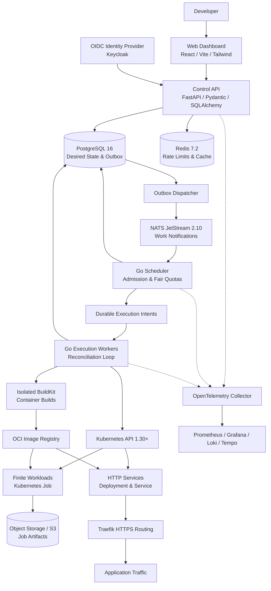

# HamiCloud — Distributed Application Runtime

[](https://github.com/hami9/hamicloud/actions/workflows/ci.yml)
[](LICENSE)
[](#milestones)

> **Deploy an HTTP service, run a finite background job, observe what happened, and recover when something fails.**

HamiCloud is a self-hosted distributed application runtime built for developers operating internal services and background tasks on a single Kubernetes cluster. It provides a hardened control plane with durable execution intents, transactional outbox dispatch, at-least-once notifications, and automated failure recovery.

---

## 1. System Architecture & Ownership Boundaries



### Strict Responsibility Boundaries

| Component | Responsibility | Non-Negotiable Boundary |
| --- | --- | --- |
| **FastAPI Control API** | Product access, authentication, authorization, input validation, desired-state transactions, public API contract. | Never schedules workloads directly or interacts with Kubernetes APIs. |
| **Go Scheduler** | Admission control, workspace quota reservation, fair queuing, retry backoff timing, execution intent creation. | Decides *what* and *when* work is eligible; never decides *where* pods run. |
| **Go Execution Workers** | Reconciles execution intents with Kubernetes API, observes container status, updates actual state. | Claims work via bounded leases; generation & epoch fenced against stale updates. |
| **Kubernetes** | Pod placement, container lifecycle, node scheduling, resource enforcement. | Managed via deterministic, generation-scoped resources; does not own application retry semantics. |
| **PostgreSQL** | Single source of durable truth (state, attempts, releases, outbox, idempotency). | Queue messages only wake workers up; lost notifications never erase accepted work. |
| **NATS JetStream** | Durable at-least-once message delivery with explicit acknowledgment. | Not a database; consumers acknowledge only after durable intent is committed. |
| **Redis** | Atomic token buckets for rate limiting, short-lived cache. | Never used as a durable queue; database quotas remain authoritative across cache loss. |

---

## 2. Workload Lifecycles & State Machines

### Job State Lifecycle
```text
QUEUED -> ADMITTED -> STARTING -> RUNNING -> SUCCEEDED
                         |          |
                         +----------+-> RETRY_WAIT -> QUEUED
                         +----------+-> FAILED -> Dead-Letter Entry
Any active state -> CANCEL_REQUESTED -> CANCELLED
```

- **Logical Job vs. Attempt:** A logical job tracks overall intent; each run execution is an immutable `JobAttempt`.
- **Application Retry vs. Broker Redelivery:** An application retry creates a new attempt with backoff; a broker redelivery reprocesses the current notification without incrementing attempts.
- **Lease Epoch & Fencing:** Workers acquire intent claims using bounded lease epochs. A stale process cannot commit state past its epoch expiration.

### Service Release Lifecycle
```text
REQUESTED -> BUILDING -> IMAGE_READY -> DEPLOYING -> HEALTHY
                |                         |
                +-> BUILD_FAILED          +-> DEPLOY_FAILED
Rollback:
New Release -> Previous Image Digest + Prior Config -> Verification
```

---

## 3. Technology Stack & Pinned Baseline

| Layer | Technology | Pinned Version | Responsibility |
| --- | --- | --- | --- |
| **Control Plane API** | Python / FastAPI / SQLAlchemy / Pydantic | Python 3.12+, FastAPI 0.115+, Pydantic v2 | Public API, validation, auth, transactional outbox |
| **Orchestration Runtime** | Go / `client-go` / `pgx` | Go 1.23+, `client-go` v0.31+, `pgx` v5 | Admission, quota enforcement, Kubernetes reconciliation |
| **Durable Database** | PostgreSQL | PostgreSQL 16 Alpine | Primary datastore, ACID transactions, outbox table |
| **Message Broker** | NATS JetStream | NATS 2.10+ | Durable work dispatch with at-least-once delivery |
| **Rate Limiter & Cache** | Redis | Redis 7.2 Alpine | Atomic token-bucket rate limits, non-durable cache |
| **Execution Platform** | Kubernetes / containerd | Kubernetes 1.30+ | Containerized pod lifecycle, scheduling |
| **Routing / Ingress** | Traefik | Traefik v3.1+ | Ingress routing, TLS termination, path routing |
| **Telemetry** | OpenTelemetry | OTel Collector, Prometheus, Loki, Tempo | Traces, metrics, structured logs |
| **Identity & Auth** | OIDC (OAuth2 / PKCE) | Keycloak 24+ (or mock OIDC in dev) | Workspaces, tenant identity, JWT bearer tokens |

---

## 4. Repository Structure

```text
hamicloud/
  apps/
    api/                    # FastAPI control plane service
    web/                    # React / TypeScript / Vite dashboard
  runtime/
    cmd/
      hamicloud-scheduler/  # Scheduler process entry point
      hamicloud-executor/   # Executor process entry point
    internal/
      admission/            # Quota checking & fair admission
      domain/               # Core state machines & domain models
      reconciliation/       # Kubernetes controller reconciliation
      outbox/               # Event dispatch & deduplication
  contracts/
    openapi/                # OpenAPI 3.1 contracts
    events/                 # NATS JetStream JSON Schemas
  migrations/               # Alembic database migrations
  deploy/
    compose/                # Local development stack (Postgres, Redis, NATS)
    helm/                   # Production Kubernetes packaging
  examples/
    http-service/           # Sample stateless HTTP service
    finite-job/             # Sample finite processing job
  tests/
    concurrency/            # Go race condition & lease conflict tests
    e2e/                    # End-to-end user journey tests
    isolation/              # Multi-tenant boundary tests
  docs/
    adr/                    # Architecture Decision Records
    runbooks/               # Incident and recovery procedures
    evidence/               # Milestone exit verification records
  WORKLOG.md                # Real-time engineering activity and audit log
```

---

## 5. Local Quickstart (Development Environment)

### Prerequisites
- Docker & Docker Compose (v2.20+)
- Python 3.12+ (or run via container)
- Go 1.23+ (or run via container)
- Git

### 1. Start Core Infrastructure
```bash
# Clone the repository
git clone https://github.com/hami9/hamicloud.git
cd hamicloud

# Copy local environment settings
cp .env.example .env

# Start PostgreSQL, Redis, and NATS JetStream
docker compose -f deploy/compose/docker-compose.yml up -d
```

### 2. Apply Database Migrations
```bash
cd apps/api
python -m venv .venv
# On Linux/macOS: source .venv/bin/activate
# On Windows: .venv\Scripts\activate
pip install -e ".[dev]"
alembic -c ../../migrations/alembic.ini upgrade head
```

### 3. Start Control API
```bash
uvicorn app.main:app --reload --port 8000
```
Verify health:
```bash
curl -s http://localhost:8000/healthz | jq
```

---

## 6. Milestones & Progress

| Phase | Milestone | Focus | Target Evidence | Status |
| --- | --- | --- | --- | --- |
| **P0** | **M0: Design Baseline** | Contracts, ADRs, schema, initial skeletons, CI | ADRs approved, passing baseline tests, OpenAPI spec | **IN PROGRESS** |
| **P1** | **M1: First Live Application** | OIDC, workspace API, Kubernetes service deployment | Working HTTP service URL via UI; rollout visibility | PLANNED |
| **P2** | **M2: Usable MVP** | JetStream dispatch, finite jobs, retries, rollback | MVP checklist passes; failure recovery demos | PLANNED |
| **P3** | **M3: Source-to-URL** | Git webhooks, BuildKit executor, immutable digest deploy | Reproducible source builds; failed build recovery | PLANNED |
| **P4** | **M4: Multi-User Readiness** | RBAC, namespace isolation, quotas, encrypted secrets | Two-workspace isolation & negative tests pass | PLANNED |
| **P5** | **M5: Operational Evidence** | Telemetry, benchmarks, restore drill, runbooks | Benchmark report, RTO <= 60m restore drill | PLANNED |
| **P6** | **M6: HamiCloud v1.0** | Helm packaging, verification gates, public release | Definition of Done complete with linked evidence | PLANNED |

---

## 7. Security & Tenant Isolation Model

- **Workload Sandboxing:** Namespaces enforce tenant separation with Kubernetes `Restricted` Pod Security Standards. Host mounts, host namespaces, and privileged containers are strictly forbidden.
- **Secrets Management:** Secrets are encrypted at rest using AES-256-GCM. Plaintext secrets are NEVER written to event bodies, logs, traces, or database audit trails.
- **Origin Separation:** Tenant applications are served from isolated origins separate from the control dashboard. Dashboard cookies are strictly host-scoped with `HttpOnly` and `SameSite=Lax`.
- **Untrusted Outputs:** All application logs and build outputs are sanitized before dashboard rendering to prevent stored XSS.

---

## 8. License

Licensed under the Apache License, Version 2.0. See [LICENSE](LICENSE) for details.
