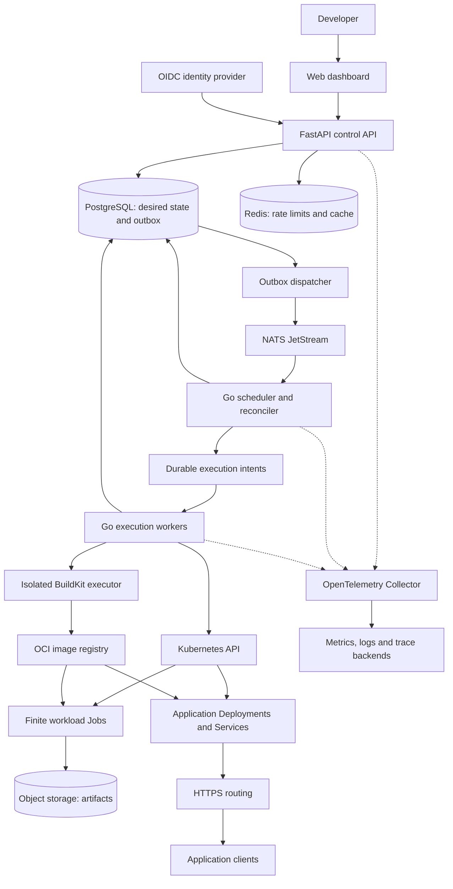

# hamicloud

```mermaid
flowchart TB
    U[Developer] --> UI[Web dashboard]
    UI --> API[FastAPI control API]
    IDP[OIDC identity provider] --> API
    API --> DB[(PostgreSQL: desired state and outbox)]
    API --> REDIS[(Redis: rate limits and cache)]
    DB --> DISPATCH[Outbox dispatcher]
    DISPATCH --> BUS[NATS JetStream]
    BUS --> SCHED[Go scheduler and reconciler]
    SCHED --> DB
    SCHED --> EXEC[Durable execution intents]
    EXEC --> WORK[Go execution workers]
    WORK --> KAPI[Kubernetes API]
    KAPI --> APP[Application Deployments and Services]
    KAPI --> JOB[Finite workload Jobs]
    WORK --> BUILD[Isolated BuildKit executor]
    BUILD --> REG[OCI image registry]
    REG --> APP
    REG --> JOB
    JOB --> STORE[(Object storage: artifacts)]
    WORK --> DB
    APP --> ROUTE[HTTPS routing]
    ROUTE --> CLIENT[Application clients]
    API -.-> OTEL[OpenTelemetry Collector]
    SCHED -.-> OTEL
    WORK -.-> OTEL
    OTEL --> OBS[Metrics, logs and trace backends]
```
